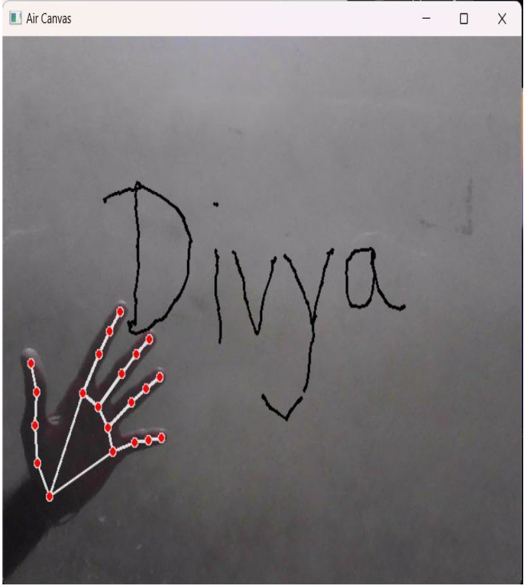

# Air Canvas 🎨

This project lets you draw in the air using your finger!  
It uses real-time hand tracking via **MediaPipe** and displays your strokes on a canvas using **OpenCV**.

## ✨ Features

- 🖐️ Draw using your index finger
- 🔄 Undo previous strokes (press `Z`)
- ❌ Clear canvas (press `C`)
- 👋 Real-time hand tracking
- 📷 Webcam-based air drawing

## 📦 Requirements

- Python 3.7+
- OpenCV
- Mediapipe
- Numpy

Install them with:

```bash
pip install -r requirements.txt
## 🖼️ Demo

  <!-- or demo.gif -->
